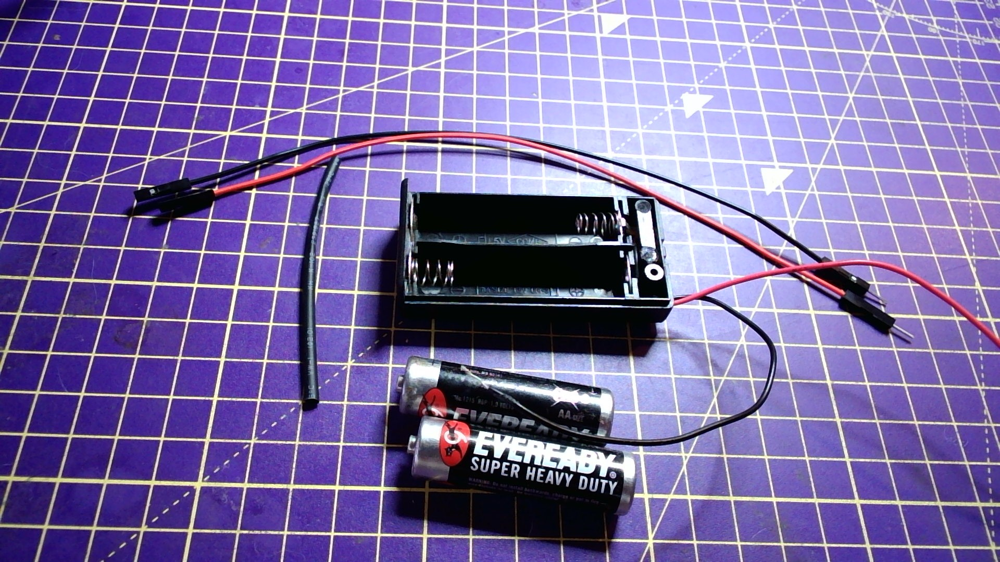

## Power a Raspberry Pi Pico with AA batteries

- You will need a two or three cell battery pack, two jumper leads with sockets, heatshrink tubing.

- Tin the ends of the leads from the battery pack

- Cut and strip two jumper leads, so that you have bare copper on one end and a socket on the other.

- Tin the ends of both jumper leads

- Place a length of heatshrink over the leads, sufficient to cover the join.

- Position the battery leads with the jumper leads and heat them to solder them together/

- Slide the heatshrink over the join.

- Use the thick edge of the soldering iron to shrink the heatshrink tubing.

- Test the battery pack on your Pico, using the `VSYS` pin and a `GND` pin.

